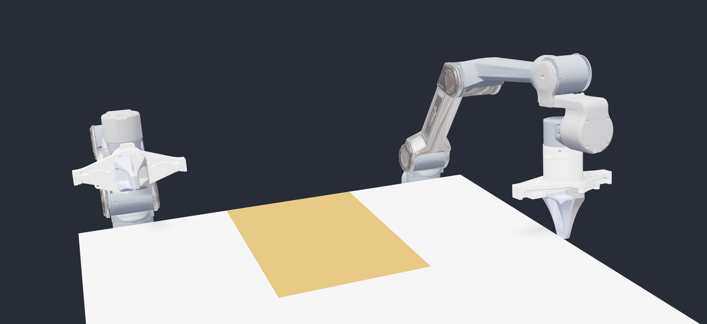
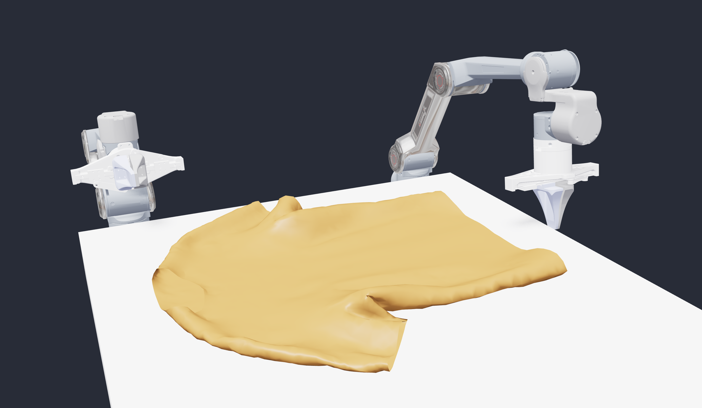

# newton cloth demo

Look at the [newton](https://github.com/newton-physics/newton) github page and follow instructions for setting up dependencies.
Afterward, add package to your PYTHONPATH.

You can then run a teleop script for cloth manipulation with the dual arm piper-x:
```bash
python cloth_teleop --grasp-mode {constraint, normal} --cloth-asset {grid, shirt}
```

## Teleop controls

| Key | Action |
| --- | --- |
| `T` | Switch teleop between the left and right arm. |
| `I` / `K` | Move the active end-effector along world X. |
| `J` / `L` | Move the active end-effector along world Y. |
| `U` / `O` | Move the active end-effector along world Z. |
| `R` / `F` | Pitch the active end-effector. |
| `G` | Toggle the active gripper open/closed. |

## Options

| Option | Description |
| --- | --- |
| `--cloth-asset grid` | Use Newton's square cloth mesh from `example_cloth_twist.py`. |
| `--cloth-asset shirt` | Use Newton's unisex shirt mesh as the cloth. |
| `--grasp-mode constraint` | Attach nearby cloth particles when the gripper closes. |
| `--grasp-mode normal` | Only actuate the gripper, with no explicit cloth attachment. |

## Isaac Sim scene

`isaacsim_newton_scene.py` recreates the scene in Isaac Sim 6. Run it with
Isaac Sim's Python, not system Python:

```bash
scripts/run_isaacsim_physx_cloth_random_arm_rgbd.sh
```

The default mode uses PhysX GPU particle cloth, imports the dual-arm URDF,
creates the table, and records the overview plus two D435 RGB-D camera streams
mounted under the imported gripper-base links. It also applies one random
target action to each arm joint before every recorded frame by default. Use
`--arm-random-scale` to tune the arm motion envelope and
`--include-gripper-actions` to also randomize the finger sliders; each gripper's
two finger joints use same-signed Isaac Sim targets with normalized limits
`[-0.05, 0]`: closed is `joint7=0, joint8=0`, and open is
`joint7<0, joint8<0`. Use
`--no-random-arm-actions` to keep the robot still, `--random-seed` to reproduce
a sequence, and `--physics-steps-per-action` to change how long each random
target is simulated.
For a minimal interactive Isaac Sim mode, run:

```bash
scripts/run_isaacsim_physx_cloth_teleop.sh
```

The Isaac Sim teleop mode supports batch size 1 and uses a minimal
end-effector controller. Controls: `T` switches active arm, `U` / `O` moves
world X, `J` / `L` moves world Y, `I` / `K` moves world Z, `Y` / `H` changes
global pitch, `N` / `M` changes global roll, `G` toggles the active gripper,
and `Esc` exits. The EE controls solve a small damped least-squares IK update
over joints 1-6, then send Isaac Sim joint position targets. Each EE update is
seeded from the current PhysX articulation joint positions, so XYZ/RP taps are
applied in the global/world frame even after contacts or joint limits have
moved the arm away from the previous command. Teleop includes a minimal
explicit adhesive-contact patch. Every env registers all finger collision-box
faces plus every non-robot collision object as adhesive surfaces. When a closed
finger surface and another surface both contact and compress the same cloth
particles, those particles are driven in the frame of the higher-friction
surface until the gripper is opened. The full scene uses the same CUDA/Torch
particle contact detection, index selection, and state-write path as the toy
scene; only small USD surface-frame metadata is converted into tensors. The
full scene discovers `UsdPhysics.CollisionAPI` prims under each finger link and
uses the generated `Cube` collision-box prims directly for the adhesive surface
frames, instead of approximating the finger from the parent link frame.
For an isolated sanity check of this explicit sticking path, use
`scripts/run_toy_isaacsim_cloth_grasp.sh`. The toy scene has two simple
kinematic box fingers, the same table geometry as the full scene, and the same
square PhysX cloth on the tabletop. It starts with the fingers open and above
the cloth, lowers until a finger bottom face presses cloth into the table,
closes, and then lifts. Pass
`--no-explicit-sticking` to disable the particle-driving patch and test native
PhysX PBD material adhesion alone. With the earlier high-friction/high-adhesion
material values, native adhesion alone did not lift the toy cloth: the
open-start test dropped the cloth, and the closed-start test kept contact for
part of the lift but produced only about `0.35 mm` max cloth-centroid lift. On
the CUDA/Torch Isaac cloth backend, keep particle contact detection, indexing,
and state writes on Torch/CUDA tensors;
converting the whole cloth state to NumPy before `set_world_positions()` can
silently terminate the Isaac app.
The toy detector ignores two surface patches from the same collision prim and
requires opposed surface normals for finger-pinch upgrades. Its default path
uses real-sized Piper finger pads (`5.6 cm x 2.4 cm x 7.6 cm` in the toy
closing frame), `--table-press-pregrasp`, `--no-upgrade-pregrasp-to-pinch`,
`--handoff-pregrasp-to-inner-patches`, `--adhesive-pair-mode finger-pinch`,
`--attach-when-closed`, and
`--no-expand-adhesive-patch`. This lets a compressed finger-table contact
stick to each finger during closing without replacing the two table-pregrasp
patches with one broad opposed-finger patch. A current headless default run
attached at step `55` with separate
`left_bottom_face+table_top` and `right_bottom_face+table_top` patches,
anchored to the matching finger bottom faces, then handed off to actual
compressed inner-face pinch patches once the fingers closed.
Adhesive seeds are limited to a
compact `1.8 cm` tangent-plane radius around each strongest pressed contact,
capped at `32` particles per candidate patch. The latest default run selected
`21` particles per finger-owned inner patch, so the driven region is two narrow
fold strips instead of a broad horizontal plate. The attachment projection
keeps the selected particles on the moving finger frames and assigns them the
finger-frame target velocity; leaving them with zero velocity injected visible
energy during lift. Inner-face patch targets are clamped slightly outside the
finger collision face into the jaw gap; preserving a measured negative normal
offset can drive cloth particles into the finger and trigger explosive contact
response during closing. The toy scene only enables table-press attachment
after the lower phase reaches the table, and it can lift the pressed patch off
the table before closing via `--preclose-lift-steps`; this avoids lateral
scraping while the cloth is trapped between the finger bottoms and tabletop.
The toy cloth uses reduced PBD stiffness, higher particle
mass, higher spring damping, a short closed-finger settle phase, and `96`
solver position iterations so the sheet waves less under the kinematic lift.
Latest local release-enabled check lifted the attached patches by about
`11 cm`, reached about `9 cm` max whole-cloth centroid lift before release in a
headless run, and released the adhesive patches at step `546`; after release,
the fingers open to their starting gap and the cloth can fall. The closed toy
finger offset is `21 mm`, which leaves about an `18 mm` inner-face gap for the
cloth. Keep that gap larger than two cloth particle contact offsets: the earlier
`16 mm` offset left only an `8 mm` jaw gap with `5 mm` particle contact offsets,
which forced penetration once both fingers closed and could inject explosive
contact energy. The inner-face adhesive target offset is `6 mm`, just outside
the particle contact envelope. A more aggressive `5 mm` gap with thinner
particle offsets looked numerically too tight and failed to lift the sheet
body, so keep the default wider unless retuning contact offsets and patch
strength together. The close phase uses `70`
scripted steps so kinematic finger motion does not outrun the particle-cloth
contact solve. The finger press height leaves about `8 mm` from finger bottom
to tabletop at the closest pregrasp point, bringing the fingertip closer to the
cloth without
returning to the earlier visual artifact where the pregrasp drove part of the
cloth into the table.
When a pressed contact involves a finger and an object, the explicit patch
anchors to the surface with the stronger material score, comparing adhesion
first, friction second, and mean normal distance to the candidate cloth
particles as the final tie-breaker. With default toy values, a finger-table press
anchors to the closer finger face; with
`--adhesive-object-adhesion 1.0`, the same press anchors to `table_top`. Use
the toy flags `--adhesive-finger-friction`, `--adhesive-object-friction`,
`--adhesive-finger-adhesion`, and `--adhesive-object-adhesion` to reproduce
either case.
In the full robot scene, confirm the log contains
`teleop <side> adhesive patch ... anchored ...`; if diagnostics only show
`contact_count=0 pressed_count=0`, then visible sticking is just PhysX material
contact and can still slip. The full scene uses a larger adhesive detection
radius for finger surfaces than the actual collision box so small frame/center
offsets in imported finger colliders do not exclude otherwise pressed cloth
particles.
With the full-scene `96` contact-seed adhesive patch size and no neighborhood
expansion, table-assisted pickup reproduces the observed slip during upward
motion. The attached patch can move while the rest of the deformable cloth
peels/slides away from the driven particles, so that failure mode is not
primarily table friction. Expanding the attached patch to nearby cloth
particles within `24 cm`, capped at `1700` particles, lifts the whole cloth
more reliably but behaves like a large grasp constraint rather than material
friction. Prefer the default finger-pinch local patch for visual realism, and
enable expansion only when a deliberately strong grasp constraint is needed.
The full-scene adhesive filter rejects surfaces with the same
`pair_group`, because the imported collision prim and fallback descriptor for
one finger link can otherwise form a false same-finger adhesive pair.
The explicit sticking detector uses a `45 mm` geometric contact margin because
the PhysX particle cloth can sit about `31 mm` above the tabletop after reset;
with the previous `30 mm` margin, table contact could miss and finger-table
sticking would never trigger.
EE taps move by `5 mm` or `1 deg`; holding a key for `0.2s` switches to
`0.48 m/s` or `120 deg/s` continuous motion for pitch and roll.
The scene binds explicit physics friction materials: the tabletop uses
static/dynamic friction `0.08/0.05` with PhysX `min` friction combine mode, while
the gripper finger links use `20.0/16.0` with `max` combine mode so cloth can
slide on the table but still grip against the fingers. Table/object surfaces
also use a low explicit adhesive ranking (`0.02`) so they can provide backing
contact without becoming the preferred anchor. The
PhysX cloth PBD material uses friction `1.2`, particle-friction scale `0.6`,
damping `0.5`, adhesion `0.0`, particle-adhesion scale `0.0`, adhesion-offset
scale `0.0`, and `8 mm` / `9 mm` rest/contact offsets. Native PBD adhesion is
kept off because the explicit adhesive patch handles grasping, while high
native adhesion/friction and high table friction made table pressing visibly
wavy and could make the cloth hard to slide on the tabletop. Teleop gripper
finger drives use max force
`3000` when closed so contacts do not easily back-drive the fingers. This
improves contact grip, but material-only cloth grasping is still solver/contact
limited. A larger `14 mm` contact offset caused the high-adhesion particle
cloth to shrink from its authored `0.33 m x 0.22 m` size to roughly
`0.105 m x 0.070 m` during PhysX reset.
The Isaac Sim URDF importer creates separate left/right articulation roots for
this dual-arm URDF, so the script rewrites them as fixed-base articulations
with world fixed joints by default, then repairs imported joint parent frames
from the URDF so the wrist and gripper fixed joints stay connected.
The Isaac-specific generated URDF keeps detailed gripper visual meshes but uses
simple box collision geometry for the four finger links by default; pass
`--no-simple-gripper-collisions` to reproduce the raw mesh-collider import.
To inspect visual-vs-collision bounds in a generated robot USD, run
`/home/horizon/isaacsim_env/bin/python scripts/inspect_isaac_gripper_collision.py <robot.usda>`.
Newton mode is still available with
`--physics-backend newton --cloth-mode visual`. Isaac Sim's documented Newton
backend does not yet expose raw Newton VBD cloth through USD, so physical Isaac
Sim cloth is a PhysX path.

Run scripts under `scripts/` capture the command lines used for:

| Script | Purpose |
| --- | --- |
| `run_isaacsim_physx_cloth_random_arm_rgbd.sh` | PhysX particle cloth with 10 reduced-scale random arm/gripper actions and three RGB-D camera feeds. |
| `run_isaacsim_physx_cloth_teleop.sh` | Minimal interactive Isaac Sim EE teleop for the PhysX cloth scene. |
| `run_isaacsim_physx_cloth_still_rgbd.sh` | PhysX particle cloth with a still robot. |
| `run_isaacsim_newton_visual_rgbd.sh` | Isaac Sim Newton backend with reduced-scale random actions and visual-only cloth. |
| `run_newton_warp_rgbd.sh` | Standalone Newton Warp-rendered RGB-D recording. |
| `run_teleop.sh` | Interactive standalone Newton cloth teleop. |

## Examples

### --cloth-asset grid


### --cloth-asset shirt

